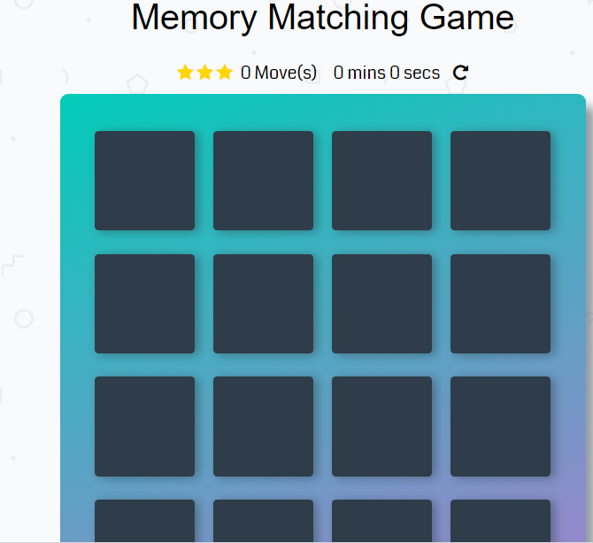
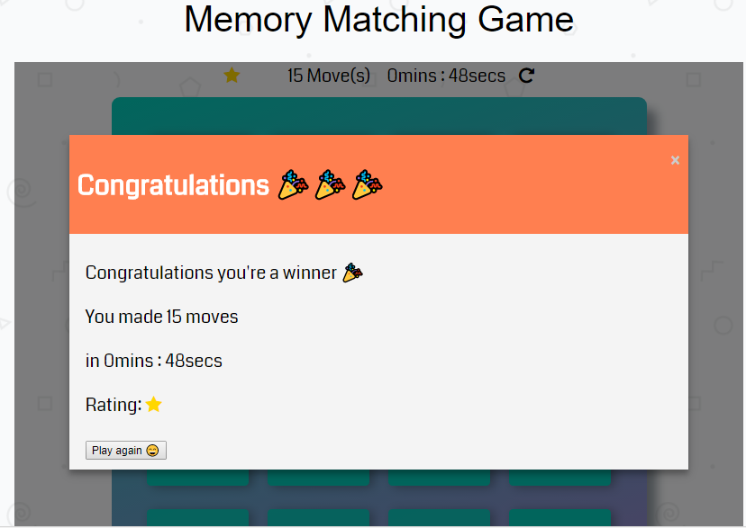

## Memory Game Project

## About The Game:

This game is built as part of the required projects to fulfill the Udacity front end web development track . The purpose of the project is to utilized and demonstrate the mastery of HTML, CSS, and JavaScript studied.

## How To Load The game.

Clone this repo and open the index.html to start the game as shown below;

## How To Play The game

The game board consists of sixteen cards arranged randomly in a grid. The deck is made up of eigth  pairs of cards, each with different symbols on one side.

The player flips one card over to reveal its underlying symbol,
The player then turns over a second card, trying to find the corresponding card with the same symbol.
If the cards match, both cards stay flipped over,
If the cards do not match, both cards are returned to their initial hidden state,
The game ends once all cards have been correctly matched.

Win Screen is shown below;

The game features a timer to keep track of how long it takes to win and reports time on win screen.

The player starts out with a three star rating -- but the rating drops the more moves it take to complete the game
When the game ends, a modal appears with the elapsed time, final star rating and a play again button.

## Required Dependencies

Ideally any modern browsers should be enough to open and play the game.

## Contributing

This repository is the complete code for my udacity memory Game project. I am very open for any suggestion that will improve the game.Because, I believe is part of the  learning procedure. Therefore, I am willing to  accept any pull requests to improve the game.

For details, check out [CONTRIBUTING.md](CONTRIBUTING.md).
